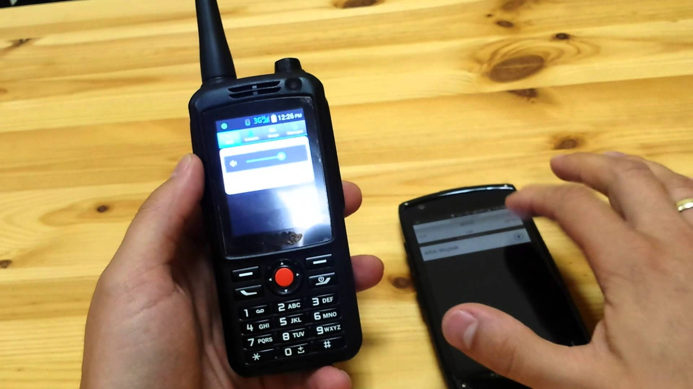
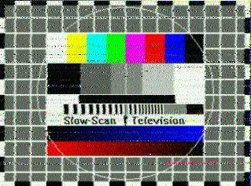
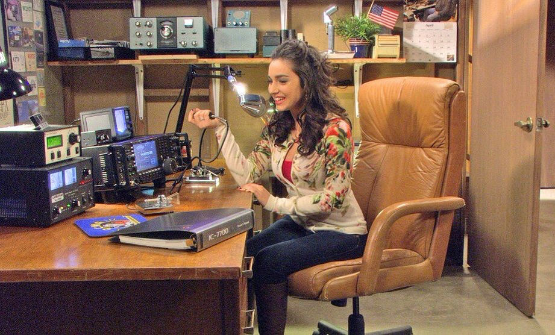
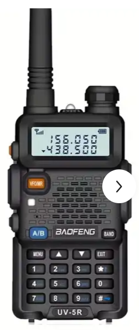
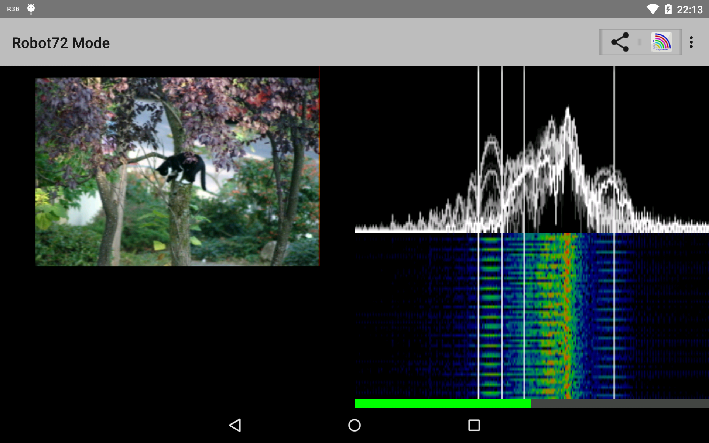
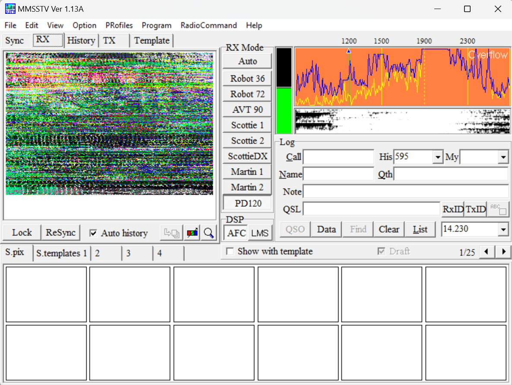
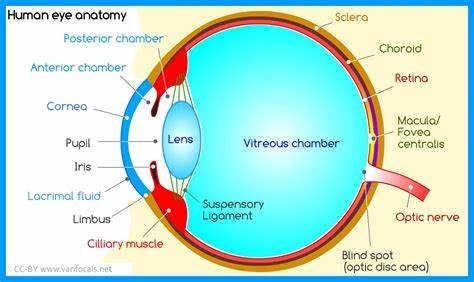

# SSTV

## Slow-scan television (SSTV)


> The idea is to transmit an image using a cheap walkie talkie and decode it using a smartphone with a free application in the simplest offline way.





Slow-scan television (SSTV) is a picture transmission method, used mainly by amateur radio operators, to transmit and receive static pictures via radio in monochrome or color.






Below is the wikipedia page that describes all about **SSTV**

[wikipedia Slow-scan_television](https://en.wikipedia.org/wiki/Slow-scan_television)

```
https://en.wikipedia.org/wiki/Slow-scan_television
```

Slow Scan Television (SSTV) is transmitted by the ARISS Russia Team from the amateur radio station in the Russian Service Module of the International Space Station using the callsign RS0ISS.


[International Space Station](https://amsat-uk.org/beginners/iss-sstv/)

[ temu.com UV-5R Amateur Handheld Radio](https://www.temu.com/be-nl/kuiper/un9.html?subj=goods-un-v2&_bg_fs=1&_p_jump_id=1054&_x_vst_scene=adg&goods_id=601099538226483&sku_id=17592307569518&adg_ctx=a-c958c204~j-bf1d6874~f-c1042688&_x_ads_sub_channel=shopping&_p_rfs=1&_x_ns_prz_type=-1&_x_gmc_catalog=1222909&_x_ns_sku_id=17592307569518&mrk_rec=1&_x_ns_catalog_id=1222909&_x_ads_channel=bing&_x_gmc_account=3534134&_x_ads_creative_id=82876063701330&_x_ns_device=c&_x_ads_account=176240820&_x_ns_match_type=e&_x_ns_msclkid=d082a11353f21acf4f2ec731601b6d55&_x_ads_set=520551216&_x_ns_source=o&_x_ads_id=1326013389856204&msclkid=d082a11353f21acf4f2ec731601b6d55&utm_source=bing&utm_medium=cpc&utm_campaign=BING_ADS%3A8B2E0E69A41C0B0D06CE836643147E1B&utm_term=4586475321715887&utm_content=BING_ADS%3A8B2E0E69A41C0B0D06CE836643147E1B)



free android encoder sstvencoder

[sstvencoder](https://play.google.com/store/apps/details?id=om.sstvencoder)



free android Robot36 - SSTV Image Decoder

[Robot36 - SSTV Image Decoder](https://play.google.com/store/apps/details?id=xdsopl.robot36)


free pc program MMSSTV



sstv image received on 4/19/2024 for testing


## From all my studies I have come to the conclusion "You can create waves but you cannot create colors, colors are not of this world."




